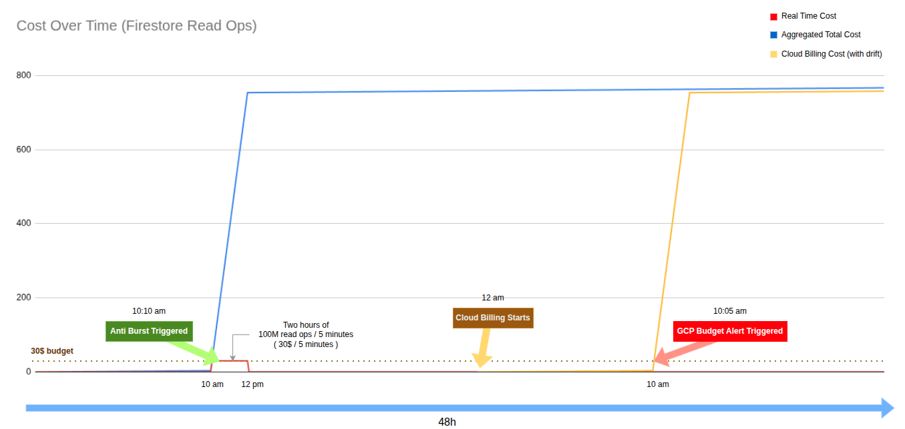
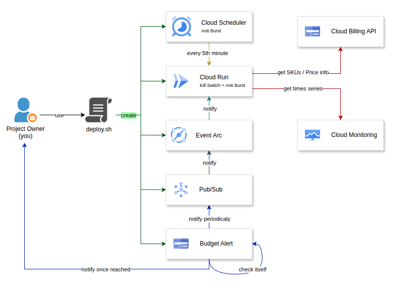
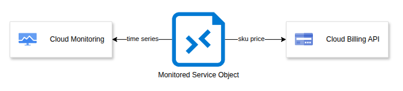

# NoBBomb


[](https://discord.gg/SgXCAQpTxy)

<span align="justify">

*No Billing Bomb (NoBBomb)*, a GCP Kill Switch & Anti-Burst solution.

## Introduction

All-in-one package to increase billing safety on GCP projects, featuring:

- An easy to configure `config.sh` file
- An easy to deploy script (`deploy.sh`) (see [Deployed Resources](#deployed-resources))
- Your project's Billing Account currency code (no conversion needed!)
- A classic GCP budget alert:
  - Email notifications
  - Pub/Sub topic + Eventarc for automatic kill switch trigger
- Custom Cloud Run service:
  - **[Experimental]**  Anti-Burst on vulnerable [services](#burst-detection---monitored-services)
    - Self-updating every 5th minute (10:00am, 10:05am, 10:10am, etc..)
    - Uses Cloud Billing API for real-time [SKU prices](https://cloud.google.com/skus)
    - Uses Cloud Monitoring API for 5-minute usage [metrics](https://docs.cloud.google.com/monitoring/api/metrics_gcp)
    - A modular architecture to add more services (see [MonitoredService Object](#monitoredservice-object))
    - Exploitable logs / http response on `/nobbomb` route (used by Cloud Scheduler)
  - Kill switch with 3 modes:
    - `SHUTDOWN`: Brutal Hard Stop ([shutdown project](https://docs.cloud.google.com/resource-manager/docs/creating-managing-projects#shutting_down_projects)) (auto unlink billing account)
    - `DISABLE_BILLING`: Hard stop ([disable billing](https://docs.cloud.google.com/billing/docs/how-to/modify-project#disable_billing_for_a_project)) (default)
    - `NONE`: Kill switch disabled -> You can add your own logic in the `kill_switch.py`

ℹ️ Kill Switch mode works for both budget mechanisms (Budget Alert & Custom Cloud Run), so if you choose `SHUTDOWN` mode for example, the project will be shutdown either on budget threshold reach or on burst detection.

## Before You Start

### Prerequisites

**[Mandatory]** Edit the `config.sh` file to set your preferences before deploying.

Ensure that you have sufficient permissions on the target GCP project (ex: *Owner*).

If you need to deploy NoBBomb to a different project, re‑authenticate so the billing information updates correctly.

Be aware that NoBBomb deployment has been tested exclusively on a `bash` shell.

### Additional Notes

Set `EXPERIMENTAL_FEATURE=0` in `config.sh` to disable the Cloud Run anti-burst feature and keep the service as a kill switch only.

Note that you won't be notified when the billing is disabled (`DISABLE_BILLING` mode) but GCP does send an email when the project is shutdown (`SHUTDOWN` mode), so you can keep this in mind when choosing the kill switch mode.

## Deployment

### Standard

Be sure to have `gcloud` CLI installed on your machine.

Then run:

```bash
bash .mise-tasks/login.sh
bash deploy.sh
```

### Mise

If you're familiar with [mise](https://github.com/jdx/mise), simply run:

```bash
mise install
mise login
mise deploy
```

## Deployed Resources

- Services
  - `artifactregistry.googleapis.com`
  - `cloudbuild.googleapis.com`
  - `run.googleapis.com`
  - `eventarc.googleapis.com`
  - `pubsub.googleapis.com`
  - `cloudscheduler.googleapis.com`
  - `billingbudgets.googleapis.com`
- Service Account
  - Named `nobbomb-kill-switch-sa@[GCP_PROJECT_ID].iam.gserviceaccount.com`
  - IAM
    - `roles/run.invoker` on the Cloud Run
    - `roles/monitoring.viewer`
    - `roles/serviceusage.serviceUsageAdmin`
    - `roles/billing.admin`
    - `roles/resourcemanager.projectDeleter`
- Current Month Budget Alert
  - Named: `nobbomb-budget-alert-[GCP_PROJECT_ID]`
- Cloud Run Service with [FastAPI](https://github.com/fastapi/fastapi)
  - Named `nobbomb-kill-switch`
- Cloud Scheduler (At every 5th minute)
  - Named `nobbomb-kill-switch-scheduler`
- Pub/Sub Topic
  - Named `nobbomb-budget-alert-topic`
- Eventarc Trigger
  - Named `nobbomb-pubsub-to-cloudrun-event-arc`

## Important Notes

The script is designed to be idempotent, it checks if resources already exist before creating them, so you can re-run it safely if needed.

The app generates its own expenses as it uses Cloud Run and Cloud Monitoring APIs, so be aware of this when deploying on low-budget projects. In my testing, it has never cost more than $1/month.

The kill switch will activate for **both** budget mechanisms:
- Cloud Budget Alert: On threshold reach OR on Cloud Run analysis
- Custom Cloud Run: On experimental burst detection, which is based on real-time SKU price and usage data

These approaches are **complementary** and increase safety, which could be summarized as:
- Budget Alert is perfect but slow
- Custom Cloud Run is fast but not perfect

As the goal is not to be accurate to the cent, but to avoid large billing surprises, all SKUs are arbitrarily fetched from `us-central1`.

Budget Alert applies to the total project cost while Cloud Run monitoring targets specific services only. For example, if Firestore alone causes a cost spike, the Cloud Run kill switch will still rely on the global monthly budget, even though other unrelated services may contribute to it. Since NoBBomb is intended to monitor specific services, this should not be an issue.

If you choose the `SHUTDOWN` mode, the project pending deletion can be found [here](https://console.cloud.google.com/cloud-resource-manager?pendingDeletion=true).

## Example Scenarios

Good Case Scenario:
- Your budget is set to 20$
- You have nothing but Firestore
- Firestore suddenly spikes to 20.01$
- NoBBomb Cloud Run detects the spike and triggers the kill switch immediately

Bad Case Scenario:
- Your budget is set to 20$
- A not monitored service (ex: Compute Engine) has a 19.99$ ongoing cost
- Firestore suddenly spikes to 19.99$ and stops
- Your total cost is now 39.98$ and only the budget alert will trigger once Billing data are updated

Note that the *bad case scenario* is far better than having no protection at all, which would be a *disaster* scenario where sky's the limit.

As NoBBomb is under heavy development, consider this behavior as a known limitation for now. I wish to improve it in the future by implementing 
a logic that could better manage these situations.

## Burst Detection - Monitored Services

Monitored services / SKUs are listed in `src/config/monitored_services_list.py`. You can remove unwanted services by editing this file before deploying. Each object should be considered as a `MonitoredService` Object. Check the [MonitoredService Object](#monitoredservice-object) section for more details.

Because some services use simple “count” metrics while others rely on more complex signals (ex: Gemini short/long context), burst-detection accuracy can vary by service. A “medium confidence” rating doesn’t mean a service isn’t monitored, it means the signal may be less precise than for high-confidence services.

**Monitored with high confidence:**
- **bigquery.googleapis.com**
  - Read Bytes Scanned
- **firestore.googleapis.com**
  - Read
  - Write
  - Delete
  - TTL delete

**Monitored with medium confidence:**
- **aiplatform.googleapis.com**
  - Text Input/Output predictions
    - gemini-3-pro
    - gemini-3-flash
    - gemini-2.5-pro
    - gemini-2.5-flash
    - gemini-2.5-flash-lite
    - gemini-2.0-flash
    - gemini-2.0-flash-lite


## Functioning Details

### Why this app ?

This project aims to help as many people as possible, especially small businesses, students, and non-critical projects (dev environments, sandboxes).

Here's an example graph illustrating GCP billing lag times using Firestore read operations:



Note that this is a *very* worst-case scenario graph, as GCP billing lag times can vary. My point here is to insist on the drifting nature of GCP billing.

- [GCP Budget Amount Documentation](https://docs.cloud.google.com/billing/docs/how-to/budgets#budget-amount)
> Caution: The budget doesn't automatically set a hard cap on spending. We recommend that you set your budget amount below your available funds, to account for delays in usage reporting.

- [GCP Billing Documentation](https://docs.cloud.google.com/billing/docs/how-to/resolve-issues#missing-transactions)
> Note: Google Cloud products report usage and cost data to Cloud Billing processes at varying intervals. As a result, you might see a delay between your use of Google Cloud services, and the usage and costs being available to view in Cloud Billing. Typically, your costs are available within a day, but can sometimes take more than 24 hours.


### Architecture Overview

Here is a simplified architecture diagram of NoBBomb:




### MonitoredService Object

A MonitoredService Object represents a specific GCP service or SKU that NoBBomb monitors for potential cost spikes.

#### Raw Object
```python
class MonitoredService:
    # Hand crafted Data
    service_name: str = ""
    service_id: str = ""
    sku_name: str = ""
    sku_id: str = ""
    # Cloud Billing
    price_tier: int = 0
    # Cloud Monitoring
    metric_name: str = ""
    metric_filter: str | None = None
    # Computed Fields
    price_per_unit: float | None = None
    number_of_units: int | None = None
    expense: float | None = None
```

#### Firestore Read Example
```python
MonitoredService(
    service_name="Firestore Read Operations",
    service_id="EE2C-7FAC-5E08",
    sku_name="read_ops",
    sku_id="6A94-8525-876F",
    metric_name="firestore.googleapis.com/document/read_ops_count",
    metric_filter=None,
)
```

#### Explanation of Fields
- `service_name`: A human-readable name for the service or SKU being monitored.
- `service_id`: The unique identifier for the GCP service.
- `sku_name`: A human-readable name for the specific SKU being monitored.
- `sku_id`: The unique identifier for the specific SKU.
- `price_tier`: The price tier for the SKU (if applicable). [Example with Big Query](https://cloud.google.com/skus?hl=fr&filter=AB59-C5C0-8570).
- `metric_name`: The Cloud Monitoring metric name used to track usage for this service or SKU.
- `metric_filter`: (Optional) The metric filter associated with the metric, if applicable.
- `price_per_unit`: (Computed Field) The price per unit for the SKU.
- `number_of_units`: (Computed Field) The number of units used for the SKU, known from Cloud Monitoring data.
- `expense`: (Computed Field) The total expense calculated for the SKU. Mix of `price_per_unit` and `number_of_units`.

Basically, `service_id` and `sku_id` are filled using the [GCP SKUs Catalog](https://cloud.google.com/skus).

The `prices` object is populated at runtime by querying the Cloud Billing API to fetch the latest pricing information for the specified SKU. This way, we can know how much each unit of usage costs, using the currency code of your Billing Account.

Last but not least, the `number_of_units` field is filled at runtime by querying the Cloud Monitoring API to get recent usage data for the specified metric type. 

By knowing the SKU parent service id, the SKU id and its related metric, we can fetch how many units have been used by SKU and calculate the cost accordingly. That way, we can approximate the cost of each monitored service in near real-time because the update delay of Cloud Monitoring is only 5 minutes.

#### Monitored Service Diagram



#### Usage

`MonitoredService` are stored in a list called `MONITORED_SERVICES`.

You can find them in the `src/config/monitored_services_list.py` file.

You can customize which services to monitor by editing this list before deploying NoBBomb.

I think that the best approach is to monitor only the services that you're actually using in your project. For example, if you're using Firestore, keep only the Firestore-related `MonitoredService` Objects. This way, you can reduce false positives and focus on the services that matter most to you. That way, the anti-burst mechanism will be more effective and relevant to your specific use case.


## Disclaimer

Due to the rapid evolution of GCP, breaking changes may occur at any time. While I strive to maintain NoBBomb’s functionality, I cannot guarantee seamless operation or provide continuous, real-time updates.

GCP billing is complex and doesn't always reflect usage in real-time. While NoBBomb aims to minimize billing surprises, it cannot guarantee 100% accuracy. I created this project to explore GCP APIs and provide a helpful tool for the community. That said, **use it at your own risk**.

Testing and developing NoBBomb comes with its own GCP costs, which I cover personally. While I am not seeking financial donations, I value your respect for the work involved. You can support the project through any type of contribution, whether it's a pull request, a bug report, or simply a message with your feedback.

## Additional Notes

If you still got an unexpected billing surprise, know that there is an excellent post on the [r/googlecloud](https://www.reddit.com/r/googlecloud/) subreddit made by a (former?) Moderator, explaining what to do:

[So you got a huge GCP bill by accident, eh?](https://www.reddit.com/r/googlecloud/comments/x4gi71/so_you_got_a_huge_gcp_bill_by_accident_eh/)

In my experience, Google Cloud Support has been very helpful in resolving billing issues, especially for small projects. They could be more forgiving if it is your first time encountering such a situation. Having implemented security measures like NoBBomb can demonstrate your commitment to responsible usage, which may positively influence their decision. This is not guaranteed, but it's worth mentioning.

## License

This project is licensed under the terms of the MIT license.

</span>